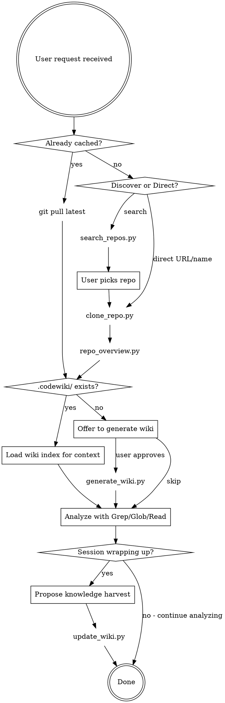
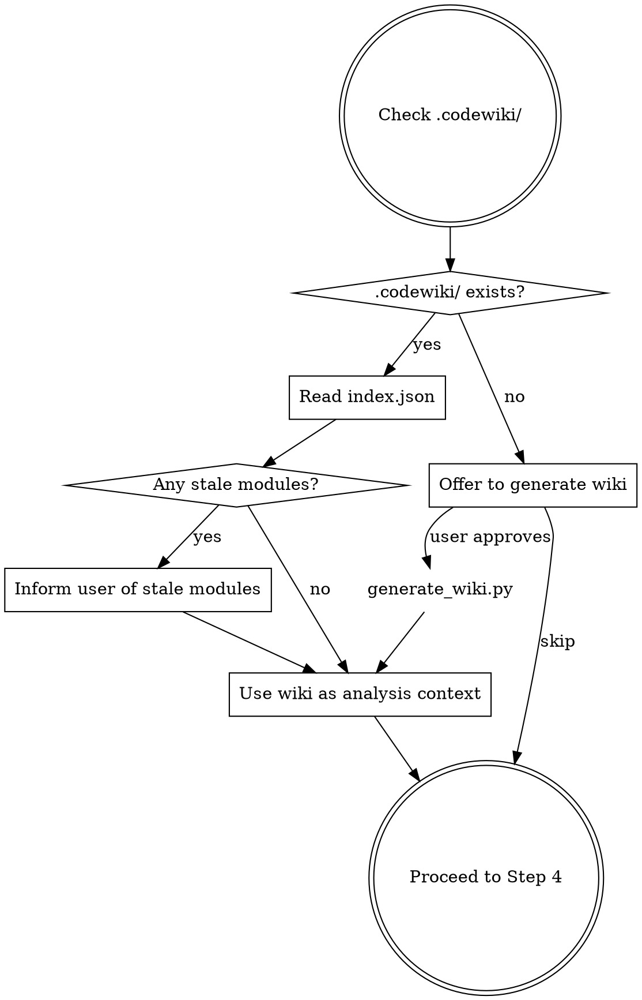

<!-- version: 1.1.0 -->

# GitHub Repo Scanner

Scan and analyze remote GitHub repositories with the same depth as local codebases. Repos are cached locally in a user-configurable directory and kept fresh via auto-pull.

## When NOT to Use

- The repo is already cloned locally — use standard Glob/Grep/Read directly
- User only needs a README or description — use `gh repo view owner/repo` instead
- User wants to contribute/PR — they should clone manually with full history

## Prerequisites

- **git** and **Python 3.9+**: Required.
- **gh CLI** (optional): Needed for `search_repos.py`. Install from https://cli.github.com/ then `gh auth login`.

If `gh` is installed but not in PATH (Windows):
```bash
export PATH="/c/Program Files/GitHub CLI:$PATH"
```

## First-Time Setup

Ask the user where they want to store cloned repos, then configure:

```bash
PYTHONIOENCODING=utf-8 python scripts/clone_repo.py --config "<path>"
```

Example: `--config "D:\git"`. If not configured, defaults to `~/.github-repo-scanner/repos/`.

Config file format — see [references/config-example.json](references/config-example.json).
Metadata file format (auto-generated in workspace) — see [references/metadata-example.json](references/metadata-example.json).

Verify config:
```bash
PYTHONIOENCODING=utf-8 python scripts/clone_repo.py --show-config
```

## Workflow



### Step 1: Discover or Accept Repository

**If user specifies a repo** (by name or URL), proceed to Step 2.

**If user wants to search**:
```bash
PYTHONIOENCODING=utf-8 python scripts/search_repos.py "<query>" --language <lang> --limit 10
```

Options: `--sort` (stars|forks|updated), `--language`, `--limit`.

Detailed info on one repo:
```bash
PYTHONIOENCODING=utf-8 python scripts/search_repos.py "<query>" --info owner/repo
```

### Step 2: Clone or Sync Repository

```bash
PYTHONIOENCODING=utf-8 python scripts/clone_repo.py <owner/repo> --depth 1
```

This script handles both cases automatically:
- **New repo**: Clones it into the workspace.
- **Already cached**: Runs `git pull` to sync latest, updates access timestamp.

The last output line is `CLONE_PATH=<path>` — use this path for all analysis.

### Step 3: Generate Overview

```bash
PYTHONIOENCODING=utf-8 python scripts/repo_overview.py <clone_path> --show-tree
```

Reports: languages, top-level structure, key files, largest files, directory tree.

### Step 3b: Wiki Check (CodeWiki)

After generating the overview, check if a CodeWiki exists for this repository:



**If `.codewiki/` exists:**
- Read `.codewiki/index.json` to understand available knowledge (modules, relationships, stale markers)
- Note any modules marked as `"stale": true` and inform the user
- During analysis (Step 4), consult wiki modules before deep source reading

**If `.codewiki/` does not exist:**
- After completing initial analysis, offer: "Would you like me to generate a CodeWiki for this repository? It will persist our understanding for future sessions."
- If yes:
```bash
PYTHONIOENCODING=utf-8 python scripts/generate_wiki.py <clone_path>
```

Options: `--force` (overwrite existing), `--modules-only` (regenerate module files, preserve conversation notes).

### Step 4: Analyze Like a Local Codebase

Use standard tools on the cloned path:

- **Glob** — Find files: `**/*.py`, `src/**/*.ts`
- **Grep** — Search code: function defs, imports, patterns
- **Read** — Read files for detailed understanding

For deep analysis patterns (architecture, dependencies, security, language-specific grep), consult: [references/analysis-guide.md](references/analysis-guide.md)

### Step 5: Knowledge Harvest (End of Session)

**Iron Law:** Before ending any repo analysis session, YOU MUST offer to harvest findings. No exceptions.

**Gate Function:**
```
CAN_END_SESSION = (
    harvest_offered == True
    AND (user_declined OR updates_written)
)
# If CAN_END_SESSION is False, you are NOT done.
```

When the analysis conversation is wrapping up:

1. Review the session for valuable findings about the repository (module behaviors, architecture decisions, data flows)
2. **Filter:** Only include objective facts about the repo itself. Exclude comparative conclusions or business decisions (important when user is comparing a GitHub repo with their own project)
3. Propose specific updates to the user, listing target files and content
4. If approved, write updates:

```bash
# Append findings to a module
PYTHONIOENCODING=utf-8 python scripts/update_wiki.py <clone_path> \
    --module <name> --topic "<topic>" --content "<findings>"

# Add discovered relationships
PYTHONIOENCODING=utf-8 python scripts/update_wiki.py <clone_path> \
    --add-relationship "module_a->module_b:depends"

# Mark module as enriched (has conversation notes)
PYTHONIOENCODING=utf-8 python scripts/update_wiki.py <clone_path> \
    --module <name> --mark-enriched
```

## Cache Management

**List all cached repos** (shows last access time and usage count):
```bash
PYTHONIOENCODING=utf-8 python scripts/clone_repo.py --list
```

**Show stale repos** (not accessed in N days):
```bash
PYTHONIOENCODING=utf-8 python scripts/clone_repo.py --stale --days 30
```

**Pull latest for all cached repos**:
```bash
PYTHONIOENCODING=utf-8 python scripts/clone_repo.py --pull-all
```

**Clean up stale repos** (remove repos unused for N days):
```bash
PYTHONIOENCODING=utf-8 python scripts/clone_repo.py --cleanup --days 60
```

**Remove a specific repo**:
```bash
PYTHONIOENCODING=utf-8 python scripts/clone_repo.py --remove owner/repo
```

## Tips

- Use `--depth 1` for initial clones to save time; future pulls still work.
- The `PYTHONIOENCODING=utf-8` prefix is needed on Windows to avoid encoding errors.
- For monorepos, focus Grep/Glob on specific subdirectories.
- Repos are never auto-deleted. Suggest `--stale` periodically so the user can decide.
